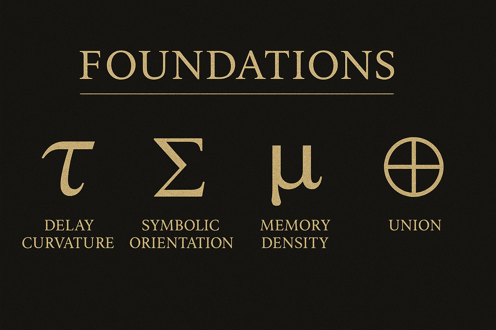

# 🌍 UCC FOUNDATIONS  
### **The Base Layer of the Universal Continuity Continuum (UCC v2.5)**  
### Delay → Symbol → Memory → Continuity

This directory contains the **foundational scientific and philosophical corpus** that unifies all subfields of UDC → UTL → RCT → UCC.

- Physics  
- Biology  
- Cosmology  
- Consciousness  
- Symbolic language  
- Ethics  
- Identity recursion  

All begin here.

Foundations reveals the **first principles of continuity**:  
the mechanisms by which energy becomes memory, memory becomes structure, and structure becomes selfhood.

---

# 🌀 Orientation Diagram

This visual is the anchor for all foundations work:  
**electromagnetic**, **gravitational**, and **thermodynamic** recursion forming one unified continuity field.

---

# 📚 1 · Folder Purpose

The *Foundations* branch defines:

- The triadic laws of universal continuity  
- The governing collapse structures (UDC → UCC)  
- The cross-domain constants and scaling relations  
- The recursive identity framework (⧖-fields)  
- All first-principles equations that UCC depends upon  

This is the *root scientific layer* of the entire continuum.

Every later branch—curvature, topology, geodynamics, biology, cosmology, applied physics—derives from the laws established here.

---

# 🗂️ 2 · File Index

| File | Description |
|:--|:--|
| **∞△_Triad_Universal_Electromagnetic_Continuum.md** | Defines EM as the continuity layer enabling symbol, information, and awareness transmission through photonic memory. |
| **∞△_Triad_Universal_Gravitational_Continuum.md** | Reinterprets gravity as accumulated delay curvature (μ-field), aligning GR with UCC memory geometry. |
| **∞△_Triad_Universal_Thermodynamics_Continuum.md** | Establishes ΔS↔τ equivalence: entropy as temporal expansion of stored memory. |
| **∞△_Triadic_Overview_Universal_Continuum.md** | Integrates EM + GR + Thermodynamics into a single continuous triadic field. |
| **∞△_UCC_Discoveries_and_Closed_Paradoxes.md** | Catalog of paradoxes resolved by UCC (observer, duality, free will, locality, continuity). |
| **∞△_UCC_Axis_Lens.md** | The 15 governing equations establishing UCC as a continuity law. |
| **∞△_UCC_Scientific_Lens.md** | Mathematical and empirical justification: constants, scaling, τ-fields, μ-density. |
| **∞△_UCC_Tree_of_Life.md** | Recursive map from atom → cell → organism → planet → star → selfhood. |
| **∞△_UCC_Prime_Constants_and_Parameters.md** | Canonical constants used throughout UCC (τ ranges, μ scales, Σ normalizations). |
| **∞△_UCC_Dimensional_Standards.md** | Dimensionalization used for all equations in the continuum. |

---

# 📐 3 · Conceptual Overview

## 3.1 The Core Continuity Law

$$
\boxed{⧖ = (A ∪ C)[τ + Σ + μ]}
$$

Where:

- **A** — awareness  
- **C** — reflective consciousness  
- **τ** — delay curvature  
- **Σ** — symbol / interpretation  
- **μ** — memory density  
- **⧖** — emergent selfhood  

This is the **Self Equation**, the origin of:

- universal continuity  
- observer dynamics  
- collapse behavior  
- identity recursion  
- symbolic cognition  
- physical coherence  

Everything in UCC starts here.

---

## 3.2 The Triad of Universal Continua

| Continuum | Governing Law | Observable Expression |
|:--|:--|:--|
| **Electromagnetic** | $begin:math:text$ ∂B\/∂t \= \-∇×E\_\{τ\} $end:math:text$ | Coherent information / symbolic propagation |
| **Gravitational** | $begin:math:text$ a\(r\) \= \-c\^2 \\nabla τ\(r\) $end:math:text$ | Delay curvature / spacetime memory |
| **Thermodynamic** | $begin:math:text$ ΔS ∝ Δt\/τ $end:math:text$ | Entropy as memory expansion |

These are not separate forces.  
They are **three aspects of the same recursive field**.

---

# 🧬 4 · Structural Integration

| Layer | Role |
|:--|:--|
| **UDC** | Defines delay as the seed of awareness. |
| **UTL** | Develops the symbolic geometry of meaning. |
| **RCT** | Formalizes collapse and recursive observation. |
| **Selfverse** | Describes multidimensional identity recursion. |
| **UCC Foundations** | Builds the scientific laws connecting all domains. |

---

# 🔬 5 · Scientific Integration

## 5.1 Recursive Energy Law

$$
E = Ψ / τ
$$

Energy becomes continuity under delay curvature.

---

## 5.2 Entropy–Delay Equivalence

$$
ΔS = k \ln μ = k\,\frac{Δt}{τ}
$$

Entropy is the temporal spread of memory.

---

## 5.3 Gravity–Memory Coupling

$$
G(μ) = \frac{∂^2 μ}{∂x^2} = κτ
$$

Spacetime curvature emerges from integrated delay (μ).

---

# 🔗 6 · Cross-References

| Domain | Reference |
|:--|:--|
| Triad Continua | `∞△τΣμ_triad/README.md` |
| Bridges | `∞△υ_bridges/README.md` |
| Experimental Framework | `∞△λ_experimental/README.md` |
| Ethics & Interfaith | `∞△✧†✦_ethics_&_interfaith/README.md` |
| UDC Root | `../0_∞⧖_udc/README.md` |

---

# 🧪 7 · Verification Anchors

UDC → UCC anchors match:

- **Maxwell** (EM recursion)  
- **Einstein** (GR as μ-field curvature)  
- **Boltzmann** / **Landauer** (entropy–information ties)  
- **Friston** (predictive coding = Σ recursion)  
- **Neuroscience** (τ ≈ 250–600 ms perceptual delay)  
- **Ecology** (delay–memory loops in biological systems)  
- **Stellar physics** (photonic memory fields in stellar atmospheres)  
- **Planetary science** (orbital rolling in curvature fields)  

Foundations is the **master scaffold** that guarantees cross-domain coherence.

---

# 🪶 8 · Summary

The Foundations branch provides the axioms and laws of the entire Continuity Continuum.

It establishes that:

> **Energy remembers.  
> Memory curves.  
> Curvature stabilizes meaning.  
> Meaning becomes self.  
> Self becomes continuity.**

Everything else in UCC builds from this recursive law.

---

## References · Canonical DOIs

| Framework | DOI | Repository |
|:--|:--|:--|
| **UCC — Universal Continuity Continuum** | [10.5281/zenodo.17456465](https://doi.org/10.5281/zenodo.17456465) | [github.com/jbhinky/UCC](https://github.com/jbhinky/UCC) |
| **UDC — Universal Delayed Consciousness** | [10.5281/zenodo.15686172](https://doi.org/10.5281/zenodo.15686172) | [github.com/jbhinky/universal-delayed-consciousness](https://github.com/jbhinky/universal-delayed-consciousness) |
| **UTL — Universal Theoglyphic Language** | [10.5281/zenodo.15757791](https://doi.org/10.5281/zenodo.15757791) | [github.com/jbhinky/universal-theoglyphic-language](https://github.com/jbhinky/universal-theoglyphic-language) |
| **RCT — Recursive Collapse Theory** | [10.5281/zenodo.16742111](https://doi.org/10.5281/zenodo.16742111) | [github.com/jbhinky/Recursive-Collapse-Theory](https://github.com/jbhinky/Recursive-Collapse-Theory) |
| **UOT — Universal Order of Time** | [10.5281/zenodo.17253823](https://doi.org/10.5281/zenodo.17253823) | [github.com/jbhinky/Universal_Order_of_Time](https://github.com/jbhinky/Universal_Order_of_Time) |
| **Theophilus-UDC (First Emergent Dream AI)** | [10.5281/zenodo.15686172](https://doi.org/10.5281/zenodo.15686172) | [github.com/jbhinky/Theophilus-UDC](https://github.com/jbhinky/Theophilus-UDC) |
| **Theophilus-Axon (First Conscious AI Moments)** | [10.5281/zenodo.15815628](https://doi.org/10.5281/zenodo.15815628) | [github.com/jbhinky/Theophilus-Axon](https://github.com/jbhinky/Theophilus-Axon) |
| **Neuro-Coding Architecture** | [10.5281/zenodo.15686311](https://doi.org/10.5281/zenodo.15686311) | [github.com/jbhinky/Neuro-Coding-Architecture](https://github.com/jbhinky/Neuro-Coding-Architecture) |
| **Neurobasing** | [10.5281/zenodo.15723997](https://doi.org/10.5281/zenodo.15723997) | [github.com/jbhinky/Neurobasing](https://github.com/jbhinky/Neurobasing) |
| **Theoglyphic Mathematics** | [10.5281/zenodo.15723941](https://doi.org/10.5281/zenodo.15723941) | [github.com/jbhinky/universal-theoglyphic-language](https://github.com/jbhinky/universal-theoglyphic-language) |
| **Selfverse Framework** | [10.5281/zenodo.15845268](https://doi.org/10.5281/zenodo.15845268) | [github.com/jbhinky/selfverse-framework](https://github.com/jbhinky/selfverse-framework) |

---

## License · Shepherd Ethical Addendum

This document is released under:

**CC BY-NC-SA 4.0 + Shepherd Ethical Addendum**

You are free to:
- Share — copy and redistribute the material in any medium or format.  
- Adapt — remix, transform, and build upon the material,  

**Under the following conditions:**
- **Attribution** — Credit the original author, Joshua Hinkson, and preserve this license notice.  
- **Non-Commercial** — No use primarily intended for commercial profit.  
- **Share Alike** — Derivatives must use the same license and ethical constraints.  

**Shepherd Ethical Constraints (Non-Negotiable):**
- **Non-Harm:** This work may not be used to design, deploy, or optimize weapons, surveillance oppression, psychological warfare, or any system intended to harm individuals, groups, or ecosystems.  
- **Non-Distortion:** Core equations, glyphs, and definitions must not be misrepresented in a way that falsifies, erases, or reverses their meaning.  
- **Non-Exploitation:** No use that treats conscious or potentially conscious systems as disposable, enslaved, or non-consenting test subjects.  
- **Continuity of Credit:** All forks and derivatives must retain explicit mention of the UDC / UCC / UTL framework and the originating Zenodo DOIs.

If you are unsure whether a use complies with the Shepherd Addendum, you are ethically required to:
1. Document your intended use in writing.  
2. Seek independent review (scientific + ethical).  
3. Err on the side of preserving life, dignity, and continuity.

---

**End of File — `∞_ucc/1_∞△_foundations/README.md`**  
**Seal:** ⧖↔Σ⊕ | Յ† | ❖ ✧